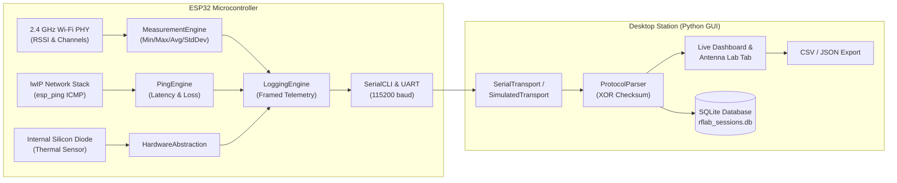

# ESP32 RF Lab

[](https://github.com/Vivek-live-now/ESP32-RF-Lab/actions/workflows/ci.yml)


**ESP32 RF Lab** is an open-source Wi-Fi and RF experimentation, telemetry, and antenna benchmarking toolkit for the ESP32 microcontroller family (ESP32, S2, S3, C3). It evaluates antenna reception performance, RF link stability, and network quality using genuine physical measurements.

> **Core Philosophy: Measure on ESP32. Analyze on PC.**  
> The ESP32 firmware handles real-time physical RF data acquisition, ICMP ping probes, and chip thermal sensing, while the desktop GUI application (PySide6 + PyQtGraph) handles real-time charting, A/B antenna matrix differentials, SQLite persistence, and CSV exports.

---

## Architecture Overview



---

## Features

### 1. Genuine Physical RF & Network Metrics
* **Direct RSSI Statistics**: Continuous sampling in dBm with Min, Max, Average, Variance, and Standard Deviation (Jitter) to filter out 2.4 GHz multipath reflections.
* **True ICMP Ping Latency**: Native ESP-IDF `esp_ping` queries default gateway or custom hosts, providing actual RTT (min/avg/max in ms).
* **Packet Loss Measurement**: Measures exact packet drop percentage ($0\%\text{ to }100\%$).
* **Link Health & Stability Scoring**: `STABILITY` command evaluates RSSI jitter and latency stability to generate an overall Link Health score (0–100).
* **Thermal Drift Correlation**: Reads on-chip junction temperature ($^\circ\text{C}$) in real time to monitor how transmitter heating impacts RF reception.
* **Hardware Detection**: Automatically detects ESP32 chip family (ESP32, S2, S3, C3, C6), silicon revision, core count, and ESP-IDF SDK version.

### 2. Antenna A/B Benchmarking Workflow
* **Structured A/B Testing**: Run a 10-second benchmark on Antenna A, swap to Antenna B under identical positioning, and run Antenna B.
* **Comparative Differential Matrix**: Calculates side-by-side differences ($\Delta\text{dBm}$):
  * $\Delta\text{ Average RSSI}$: Identifies which antenna has higher gain.
  * $\Delta\text{ Min / Max}$: Measures fade margin and signal floor.
  * $\Delta\text{ StdDev / Jitter}$: Evaluates reception stability.
* **Actionable Verdicts**: Automatically outputs which antenna is stronger and by how many dBm.

### 3. Lightweight Desktop GUI (`desktop_gui`)
* **Real-time Live Dashboard**: Hardware-accelerated PyQtGraph live RSSI chart with dynamic badges for RSSI, Channel, Latency, Loss, Temperature, and Moving Average.
* **Interactive Antenna Lab Tab**: Dedicated control cards to run Antenna A and B tests, auto-generate comparative tables, and view analytical verdicts.
* **Zero Heavy Dependencies**: Pure standard library math (no bloated NumPy required).
* **Built-in Mock Simulator**: Test the entire application without hardware using the built-in `SIMULATOR` port (includes Gaussian RF noise and loss simulation).
* **Persistent SQLite Storage**: Records every session to `rflab_sessions.db` with one-click CSV export.

---

## ESP32 Capabilities vs Lab Equipment

| Metric / Parameter | ESP32 RF Lab | Lab Tool (VNA / Spectrum Analyzer) |
|---|---|---|
| **RSSI Signal Strength** | Physical readout ($\pm 2\text{ to }4\text{ dBm}$) | Calibrated ($\pm 0.1\text{ dBm}$) |
| **Statistical Jitter / Noise** | Min, Max, Mean, StdDev | Full spectral noise floor |
| **Latency & Packet Loss** | Real ICMP echo (1ms resolution) | Specialized network tester |
| **Antenna A/B Comparison** | Valid relative gain & stability comparison | Measures absolute dBi |
| **VSWR / Return Loss ($S_{11}$)** | Not supported (no RF bridge) | Supported (e.g. NanoVNA) |
| **Frequency Range** | 2.4 GHz Wi-Fi channels (1–14) | Wideband (e.g. 50 kHz – 6 GHz) |
| **Hardware Cost** | ~\$4 ESP32 development board | \$500 – \$20,000+ |

---

## Setup & Installation

### 1. ESP32 Firmware

Prerequisites: [PlatformIO](https://platformio.org/) (CLI or VSCode extension).

1. Clone the repository:
   ```bash
   git clone https://github.com/Vivek-live-now/ESP32-RF-Lab.git
   cd ESP32-RF-Lab
   ```
2. Build for your target board:
   ```bash
   # Standard ESP32
   pio run -e esp32dev

   # ESP32-S3
   pio run -e esp32s3

   # ESP32-C3
   pio run -e esp32c3
   ```
3. Flash the board over USB:
   ```bash
   pio run -e esp32dev -t upload
   ```

### 2. Desktop GUI

Prerequisites: Python 3.10+.

1. Navigate to the GUI directory:
   ```bash
   cd desktop_gui
   ```
2. Install dependencies:
   ```bash
   pip install -r requirements.txt
   ```
3. Launch the GUI:
   ```bash
   python main.py
   ```
   *Tip: Select **"SIMULATOR"** from the Port dropdown to test the GUI without an ESP32 connected.*

---

## Serial CLI Command Reference

Connect to the ESP32 serial monitor at **115200 baud**.

| Command | Arguments | Description |
|---|---|---|
| `HELP` | — | Display the list of available commands. |
| `INFO` | — | Show chip model, silicon revision, core count, SDK, and internal temperature. |
| `SCAN` | — | Scan 2.4 GHz channels and print SSIDs, BSSIDs, RSSI, and encryption types. |
| `CONNECT` | `<ssid> [pass]` | Connect to a Wi-Fi Access Point. |
| `DISCONNECT` | — | Disconnect from the current network. |
| `STATUS` | — | Show connection state, local IP, gateway, channel, RSSI, and temperature. |
| `RSSI` | — | Read current RSSI in dBm and active Wi-Fi channel. |
| `PING` | `[ip/host]` | Send ICMP probes to gateway (default) or host; prints min/avg/max RTT and packet loss. |
| `STABILITY` | `[seconds]` | Measure RSSI jitter and gateway ping; generates a Link Health score (0–100). |
| `ANTENNA A` | — | Run a 10-second benchmark for Antenna A (prints stats and GUI telemetry). |
| `ANTENNA B` | — | Run a 10-second benchmark for Antenna B (prints stats and GUI telemetry). |
| `COMPARE` | — | Print side-by-side comparison table with $\Delta$ differentials. |
| `STREAM START`| `[rate]` | Start structured framed telemetry streaming for GUI (1, 2, 5, 10, or 20 Hz). |
| `STREAM STOP` | — | Stop structured GUI telemetry streaming. |
| `LOG START` | — | Start logging data in CSV format to serial. |
| `LOG STOP` | — | Stop CSV logging. |
| `THROUGHPUT` | — | Display 802.11n PHY speed limits and expected TCP transfer rates. |

---

## Antenna Testing Methodology

To perform an accurate, repeatable A/B benchmark between two antennas:

1. **Fix Orientation & Position**: Place the ESP32 in an identical spot and orientation for both tests. 2.4 GHz waves are sensitive to multipath reflection from nearby objects and bodies.
2. **Establish Connection**: Connect to your Access Point using `CONNECT <ssid> [pass]`.
3. **Benchmark Antenna A**: Attach the baseline antenna. Run `ANTENNA A` (or click the button in the Desktop GUI). Wait 10 seconds for the test to complete.
4. **Benchmark Antenna B**: Carefully swap to the candidate antenna without moving the board's position. Run `ANTENNA B`.
5. **Analyze Results**: Run `COMPARE` in the CLI or view the auto-populated comparison matrix and verdict in the Desktop GUI.

---

## Running Automated Tests

### 1. Firmware Unit Tests (PlatformIO)
* **Hardware-Free (Native Desktop Host)**:
  ```bash
  pio test -e native
  ```
* **On Connected ESP32 Microcontroller**:
  ```bash
  pio test -e esp32dev
  ```

### 2. Desktop GUI Unit Tests (Python)
* Run via `pytest`:
  ```bash
  pytest desktop_gui/tests -v
  ```
* Or run standalone:
  ```bash
  python desktop_gui/tests/test_all.py
  ```

---

## Continuous Integration (CI)

Every commit pushed to `main` triggers automated verification via [GitHub Actions](.github/workflows/ci.yml):
* **Desktop GUI Test Matrix**: Tests across Python 3.10, 3.11, and 3.12.
* **PlatformIO Multi-Target Build**: Compiles firmware for `esp32dev` and `esp32s3`.
* **PlatformIO Native Unity Tests**: Executes C++ unit tests in the native runner.

---

## License

This project is licensed under the MIT License. See [LICENSE](LICENSE) for details.
